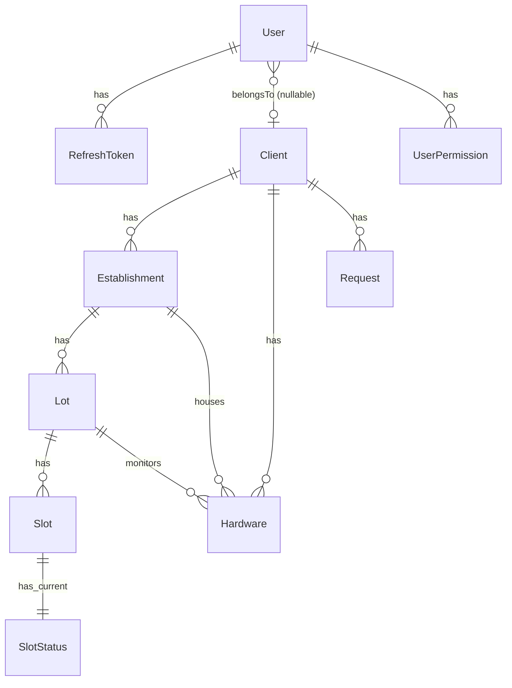

# SmartPark – MVP (Versão Enxuta e Implementável)
>
> Documento consolidado do escopo mínimo viável para o SmartPark (UPX – Facens), orientado a liberar rapidamente um protótipo funcional que valide o problema/solução e gere aprendizado real com usuários e clientes.

---

## 0 Objetivo do MVP

Validar que o sistema consegue:

1) Autenticar usuários (JWT + Refresh) e autorizar por **roles/claims**.  
2) Receber **eventos do hardware** (câmera com visão computacional) e atualizar o **status de vagas**.  
3) Permitir que **usuários comuns** consultem disponibilidade de vagas.  
4) Permitir que **clientes** (empresas) gerenciem seus **estabelecimentos, pátios e hardware** de forma básica.  
5) Permitir que o **admin** aprove **cliente/estabelecimento** e cadastre **hardware**.

> Fora do MVP: histórico completo, mapa de polígonos das vagas, heartbeat/UNKNOWN, idempotência avançada, auditorias detalhadas e dashboards ricos.

---

## 1 Autenticação & Autorização (MVP)

- **Access Token (JWT)** de curta duração (ex.: 15–30 min).
- **Refresh Token** de longa duração (ex.: 7–30 dias) com **hash SHA‑256 + salt** persistido.
- **Rotação de Refresh** (obrigatória): ao usar `/auth/refresh` emitir **novo** RT, invalidando o anterior; detectar **reuso** e revogar a sessão.
- **Assinatura JWT**: HS256 (chave única) ou RS256 (par de chaves).  
- **Claims mínimas do Access Token**:
  - `sub` (userId), `role` (`app_user` | `client_admin` | `admin`)
  - `client_id` (quando aplicável — usuário ligado a um tenant)
  - `jti` (id do token) e `sid` (id da sessão para revogação/rotação)
  - (opcional) `permissions`/`scope` para granularidade (ex.: `est:read`, `hw:read`)

### 1.1 Fluxo de Login/Refresh

1) `POST /auth/login` → retorna `accessToken` + `refreshToken` (RT **não** vai em cookie no MVP).  
2) `POST /auth/refresh` → exige RT atual; se válido, retorna **novos** `accessToken` + `refreshToken`; **revoga** o RT antigo.  
3) `POST /auth/logout` (opcional) → revoga RT(s) da sessão.  

### 1.2 Segurança do Refresh Token

- Tabela `refresh_tokens` com: `user_id`, `session_id`, `token_hash`, `created_at`, `expires_at`, `revoked_at`, `ip`, `user_agent`.
- **Hash**: `SHA-256(salt || rawToken)`; armazenar `salt` por registro ou derivar com KDF.
- Em caso de **reuso** detectado → revogar todos os RT da `session_id`.

### 1.3 API Key para Hardware

- Chave de ingestão por **hardware**.  
- Armazenar **hash** (igual RT).  
- Header: `X-API-Key`.  
- Escopo: `hardware_id`, `client_id`.  
- Permissões: **somente** POST de eventos.

---

## 2 Papéis & Permissões (MVP)

### 2.1 Tipos de usuário

- **Usuário comum (`app_user`)**: usa o app p/ consultar disponibilidade; gerencia **próprio perfil**.
- **Funcionário administrativo (`client_admin`)**: gerencia dados da **própria empresa**, visualiza **estabelecimentos/lots/slots/hardware** da empresa e **abre solicitações** (novo hardware/estabelecimento/lote). Pode criar novas contas administrativas com permissões menores.
- **Admin (`admin`)**: gerencia o sistema (aprovações, cadastros, visão global).

> **Permissões menores (MVP)**: modelar como `client_manager` (pleno) e `client_operator` (restrito: leitura + solicitações). Ambos entram sob `client_admin` no JWT e a granularidade é feita por `permissions`/`claims` ou tabela `client_admin_roles`.

### 2.2 Matriz de ações por papel

- **app_user**
  - GET/UPDATE **/me** (perfil)  
  - GET público: estabelecimentos, status/agregados
- **client_admin**
  - GET/UPDATE dados do **Client** (tenant próprio)  
  - GET status de estabelecimentos/lots/slots/hardware do **tenant próprio**  
  - POST **Requests**: novo estabelecimento, novo lot/slots, novo hardware  
  - POST criar **novos admins** (menor privilégio) do próprio tenant
- **admin**
  - POST **clients**; aprovar **establishments**; cadastrar **lots/slots** e **hardware**  
  - GET visão global; GET eventos não sensíveis  
  - Decidir **Requests**: `Approved`/`Rejected`

---

## 3 Estados, Fluxos e Regras de Negócio

### 3.1 Estados

- **Client**: `PendingApproval` → `Active` → `Suspended` (opcional)
- **Establishment**: `PendingApproval` → `Active` → `Inactive`
- **Hardware**: `Active` | `Inactive` (estados de provisioning/installed são opcionais)
- **Request**: `Open` → `Approved` | `Rejected`

### 3.2 Fluxos

1) **Cliente**: Admin cria Client + **Conta Admin Primária** (ou Request aprovado).  
2) **Estabelecimento**: `client_admin` abre Request → Admin **aprova** → vira `Active`.  
3) **Lot & Slots**: após estudo, Admin cadastra (ou Request vira cadastro). No MVP basta `code` do slot e `type` (`car`/`moto`).  
4) **Hardware**: Admin cadastra e **ativa**, gerando API Key (hash no banco).  
5) **Operação**: Hardware envia **eventos** → API atualiza `SlotStatus`.  
6) **Usuário comum**: auto-cadastro sem aprovação.

### 3.3 Regras de validação (MVP)

- Escopo por **tenant**: `client_admin` só acessa recursos do `client_id` da claim.  
- `slotCode` deve existir para o `lot`.  
- `hardware.client_id` deve bater com `lot.establishment.client_id`.  
- Estados de vaga **permitidos**: `FREE`/`OCCUPIED`. (Sem `UNKNOWN`/heartbeat neste MVP.)  
- Requests só mudam de estado por **admin**.

---

## 4 Modelo de Dados (Conceitual → orientar DBML)
>
> Simples, direto e suficiente para o MVP. (Histórico, mapas de polígonos e auditorias ficam para depois.)

### 4.1 Identity

- **User** { id, name, email, password_hash, role, (nullable) client_id_fk, created_at, updated_at }
- **RefreshToken** { id, user_id_fk, session_id, token_hash, salt, created_at, expires_at, revoked_at, ip, user_agent }
- **UserPermission** (opcional p/ granularidade) { user_id_fk, permission }

### 4.2 Tenant/Empresa

- **Client** { id, name, document, status, created_at }
- **ClientAdminMember** (opcional) { id, user_id_fk, client_id_fk, admin_level }

### 4.3 Local & Estacionamento

- **Establishment** { id, client_id_fk, name, address, status }
- **Lot** { id, establishment_id_fk, code, name, notes }
- **Slot** { id, lot_id_fk, code, type(`car`|`moto`), active(bool) }
- **SlotStatus** { slot_id_fk (PK), status(`FREE`|`OCCUPIED`), vehicle(`car`|`moto`|`none`), changed_at }

### 4.4 Hardware & Solicitações

- **Hardware** { id, client_id_fk, establishment_id_fk, lot_id_fk, code, api_key_hash, salt, status, last_seen_at }
- **Request** { id, client_id_fk, type(`NewEstablishment`|`NewLot`|`NewHardware`), payload_json, status(`Open`|`Approved`|`Rejected`), created_by, decided_by, decided_at, created_at }

### 4.5 Diagrama (Mermaid – alto nível)



---

## 5 API (Contrato Essencial)

### 5.1 Auth

- `POST /auth/register` (cria **app_user**)  
- `POST /auth/login` → `{ accessToken, refreshToken }`  
- `POST /auth/refresh` → rotação de RT  
- `POST /auth/logout` → revoga sessão (opcional)

### 5.2 Usuário

- `GET /me` | `PATCH /me`

### 5.3 Público (para app de usuário)

- `GET /public/establishments?city=...`
- `GET /public/establishments/{id}/status` (agregados)
- `GET /lots/{lotId}/status` (snapshot por slot)

### 5.4 Client Admin / Admin

- **Admin**
  - `POST /clients`
  - `POST /establishments` (aprovação) | `PATCH /establishments/{id}`
  - `POST /lots` | `POST /lots/{id}/slots`
  - `POST /hardware` | `PATCH /hardware/{id}`
  - `GET /requests` | `PATCH /requests/{id}` (aprovar/rejeitar)
- **Client Admin**
  - `GET /client` | `PATCH /client`
  - `GET /establishments?client_id=me`  
  - `GET /hardware?client_id=me`
  - `POST /requests` (abrir solicitações)

### 5.5 Ingestão (Hardware)

- `POST /events/slot-status`  
  **Headers**: `X-API-Key: *****`  
  **Body (MVP):**

  ```json
  {
    "hardwareCode": "CAM-ENTRADA-01",
    "lotId": "UUID-DO-LOT",
    "items": [
      { "slotCode": "A1", "status": "OCCUPIED", "vehicle": "car",  "occurredAt": "2025-09-12T15:10:04Z" },
      { "slotCode": "A2", "status": "FREE",     "vehicle": "none", "occurredAt": "2025-09-12T15:10:04Z" }
    ]
  }
  ```

---

## 6 Regras de Autorização (Resumo Operacional)

- **Admin**: acesso global.  
- **Client Admin**: filtrado por `client_id` (claim/tenant).  
- **App User**: apenas endpoints públicos + `/me`.  
- **Hardware**: somente ingestão, validado por `api_key_hash` + vínculo `hardware.client_id == lot.establishment.client_id`.

---

## 7) Critérios de Aceitação (Checklist MVP)

- [ ] Login/Refresh/Logout funcionam; rotação de RT e revogação testadas.
- [ ] `client_admin` só enxerga dados do próprio tenant.
- [ ] Admin aprova estabelecimento; recursos passam a `Active`.
- [ ] Cadastro de `lot` e `slot` funciona; `slotCode` único por `lot`.
- [ ] Ingestão de eventos atualiza `SlotStatus` imediatamente.
- [ ] App público lista estabelecimentos e mostra disponibilidade correta.
- [ ] Chaves de hardware com hash; rejeição quando inválidas.
- [ ] Logs básicos estruturados (auditoria mínima de mudanças críticas).

---

## 8 Roadmap Pós‑MVP

- Histórico (`SlotStatusHistory`) e métricas agregadas.  
- Mapa de polígonos por vaga e histerese/debounce central.  
- Heartbeat de hardware e estado `UNKNOWN`.  
- Idempotência por `eventId/sequence`.  
- Painéis/dashboards, exportações e relatórios.  
- LGPD avançada: anonimização/blur e políticas de retenção.

---

## 9 Glossário

- **Client**: empresa contratante (tenant).  
- **Establishment**: unidade física.  
- **Lot**: pátio/área de estacionamento de um estabelecimento.  
- **Slot**: vaga individual, identificada por `code` (ex.: `A1`).  
- **SlotStatus**: estado atual da vaga (`FREE`/`OCCUPIED`).  
- **Hardware**: câmera/agente de visão conectada ao lot.  
- **Request**: solicitação aberta por `client_admin` para criação/alteração de ativos que exige aprovação do `admin`.
